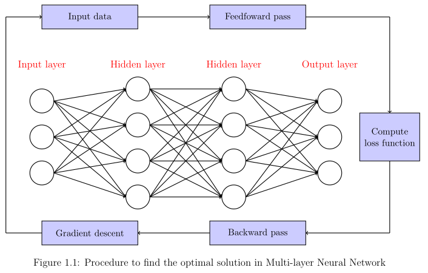
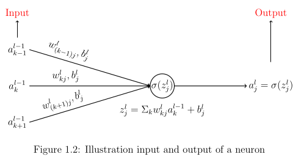
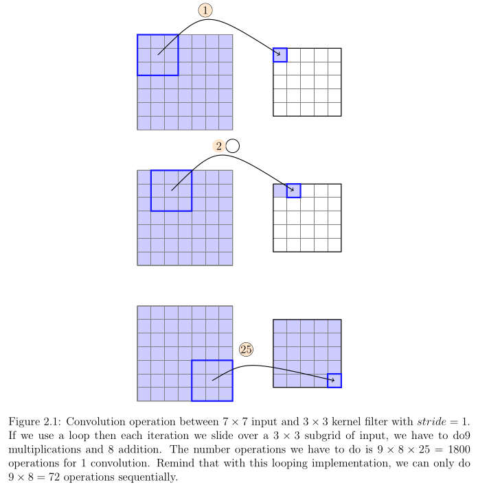
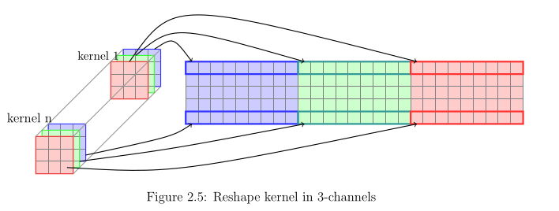

Summary some fundamental elements that need to be concretely comprehended for deep learning reseacher.\\

Sources of referencing that I have used:
+ (Book) Deep learning by Ian Goodfellow, Yoshua Bengio and Aaron Courville (https://www.deeplearningbook.org/)
+ (Blog) Convolutional Neural Network with Numpy (Fast) (https://hackmd.io/@machine-learning/blog-post-cnnumpy-fast)
+ (Book) Neural Network and Deep Learning by Micheal Nielsen (http://neuralnetworksanddeeplearning.com/index.html)
+ (Slide) Standford CS229: Machine learning by Andrew Ng (https://cs229.stanford.edu/)

Some figures that I used to illustrate the ideas in this summary note:

  

  

  

